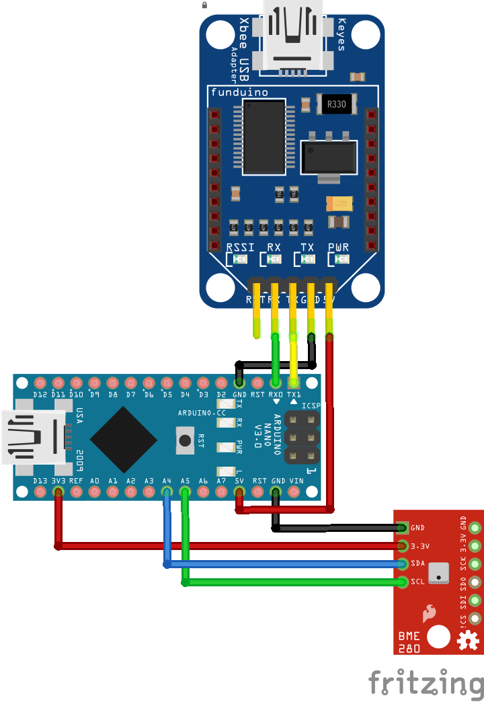
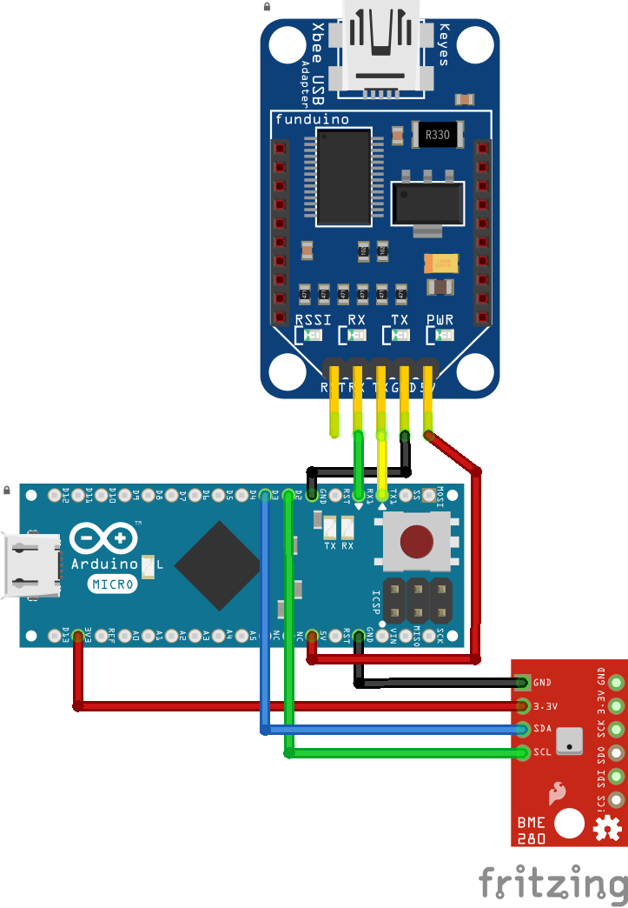

# bme280 with xbee

### configuration
you can pullup/down on some of these sensor modules to change the address, there is a define for the sensor address at the top of the sketch.

remember to change the BASE_SL to your base stations low address and NODE_ID to the unique id you want for each node.

### boards
when using an arduino micro or mega, the xbee is connect to Serial1, define at the top of sketch:
```
#define SERIAL_DEBUG
```

if you want to use the arduino wired serial connection you can do this:
```
#define SERIAL_DATA
```
which will cause the arduino to output its data over serial, the data is serialised using msgpack.

### wiring
Wiring for an arduino nano 328p:



Wiring for an arduino micro 32u4:


