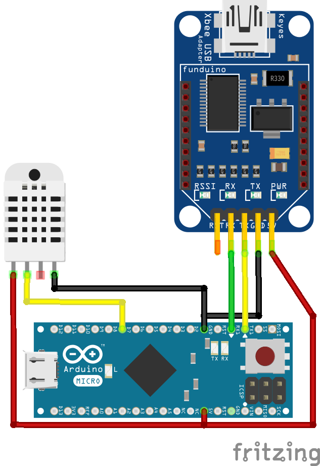

# dht22 with xbee

###configuration


###troubleshooting, etc
For running this on a non-micro (like a nano), you might need to change some lines in [xbee-dht22.ino](xbee-dht22.ino):

```
// remove this for a non-micro
Serial.begin(9600);
// on the nano, we will need to use Serial for xbee
Serial1.begin(9600);
xbee.setSerial(Serial1);
```

change to:

```
Serial.begin(9600);
xbee.setSerial(Serial);
```

also remove the following lines:

```
// send data to serial, including a newline (otherwise we dont really know when to end)
// dont do this for nanos or other arduinos without 2x serial outs
for (size_t i = 0; i < sizeof(data); i++) {
  Serial.print(data[i]);
}
Serial.println();
```

Wiring for an arduino micro 32u4:


