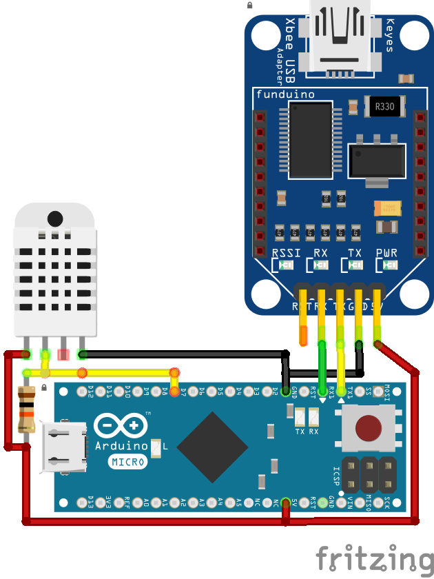

# dht22 with xbee

###configuration


### boards
when using an arduino micro or mega, the xbee is connect to Serial1, define at the top of sketch:
```
#define SERIAL_DEBUG
```

if you want to use the arduino wired serial connection you can do this:
```
#define SERIAL_DATA
```
which will cause the arduino to output its data over serial, the data is serialised using msgpack.

### wiring
Wiring for an arduino nano 328p:


Wiring for an arduino micro 32u4:


